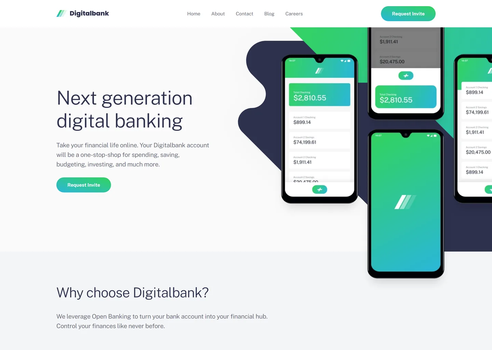

# Frontend Mentor - Digital bank landing page solution

This is a solution to the [Digital bank landing page challenge on Frontend Mentor](https://www.frontendmentor.io/challenges/digital-bank-landing-page-WaUhkoDN). Frontend Mentor challenges help you improve your coding skills by building realistic projects.

## Table of contents

- [Overview](#overview)
  - [Screenshot](#screenshot)
  - [Links](#links)
- [My process](#my-process)
  - [Built with](#built-with)
  - [Design deviations](#design-deviations)
- [Author](#author)

## Overview

### Screenshot

### Links

- Solution URL: [GitHub](https://github.com/MrBlackvanta/digital-bank-landing-page)
- Live Site URL: [Cloudflare](https://digital-bank-landing-page.abdelrhman-ahmed8881.workers.dev)

## My process

### Built with

- [Next.js 16](https://nextjs.org/) (App Router, React Compiler, Turbopack, static export)
- [React 19](https://react.dev/)
- [TypeScript](https://www.typescriptlang.org/) (strict)
- [Tailwind CSS v4](https://tailwindcss.com/)

### Design deviations

**Body copy is darkened from `#9597A5` to `#6D6F80`.** The design's grey fails WCAG AA against all
three surfaces it sits on, and it is the ink for every paragraph, the nav links, the article bylines
and the article excerpts — one token, so one fix. The replacement holds the style guide's
`hsl(233 8% …)` hue and saturation and drops lightness from 62% to 47%, which is the smallest move
that clears 4.5:1 on the worst backdrop.

|                        | design                 | contrast | shipped                | contrast |
| ---------------------- | ---------------------- | -------- | ---------------------- | -------- |
| Body copy on white     | `#9597A5` on `#FFFFFF` | 2.90     | `#6D6F80` on `#FFFFFF` | 4.96     |
| Body copy on Gray 50   | `#9597A5` on `#FAFAFA` | 2.78     | `#6D6F80` on `#FAFAFA` | 4.75     |
| Body copy on Gray 100  | `#9597A5` on `#F4F5F7` | 2.66     | `#6D6F80` on `#F4F5F7` | 4.54     |
| Copyright, white @ 50% | `#9698A6` on `#2D314D` | 4.43     | `#A0A2AF` on `#2D314D` | 4.99     |

**The button label keeps the design's contrast and is the one pairing that stays below AA.** White
bold 14px measures 1.98 on the gradient's green end and 2.39 on its cyan end, and 1.53/1.70 once the
hover state lightens both stops. Reaching 4.5:1 would need the brand gradient taken to `#1D883A` →
`#1C819B`, which is no longer the Digitalbank green — the whole page reads off it, so the design
wins and the deviation is recorded here instead.

**The hover accent splits into two tokens.** The design paints hovered article titles and hovered
footer links with the same `#30C88F`. On the navy footer that measures 5.90 and ships untouched; on
a white card it measures 2.15, so titles hover to `#208660` — the same hue and saturation with
lightness taken from 49% to 33%, the minimum that clears 4.5:1. No single colour can pass on both
surfaces: white demands a luminance at or below 0.18 and the navy footer demands at least 0.33.

**Focus rings are surface-aware for the same reason.** One ring colour cannot make 3:1 against both
white and the navy footer, so `--focus-ring` is Blue 950 by default and White inside `<footer>`.

**Every colour comes from the `.fig`, not the style guide.** Blue 950 rounds to the same `#2D314D`
either way, but the rest land a point off: Gray 600 is `#9597A5` against `#9698A6` from
`hsl(233 8% 62%)`, Gray 100 `#F4F5F7` against `#F3F4F6`, Green 500 `#33D35E` against `#32D25D`.

**Two article excerpts use the shorter string from the design file.** The starter `index.html` ends
them "We'll even show you …" and "an invite through the site ...", where the Figma frames end
"We'll even ..." and "an invite through ...". The longer strings need a fifth line at the design's
216px measure and push the cards from 390px to 406px, so the design's wording ships.

**Hero text sits at the page container, 4px right of the design.** The design starts the headline at
x=161 while the header, footer and both content sections start at x=165. One 1110px container is
worth more than reproducing a 4px inconsistency.

**Feature descriptions are 8px shorter than the design's boxes.** The 16px copy is set at the
measured 26px line height, so four lines occupy 104px against the 112px box drawn in Figma. The box
is fixed-height in the file; the line rhythm is what matches.

**Breakpoints are 640 / 768 / 1024 / 1280.** The design ships 375, 768 and 1440 frames, and its
tablet frame carries the hamburger, so the desktop navigation and the two-column hero wait for
1280 — where the 447px headline column still fits beside the artwork. 768 is the design's own
mobile/tablet switch; 640 moves the feature and article grids to two columns so the 640–767 band is
not a stretched mobile layout, and 1024 moves them to four so the 1024–1279 band is not two
544px-wide cards.

**Between 768 and 1279 the hero backdrop crops further as the viewport grows.** The band is fixed at
the design's 581px tablet height while `bg-cover` scales the 375×423 mobile artwork to fill the
width, so less of the curve is visible at 1279 than at 768. The design provides no frame in that
range.

**Scroll reveals** are transform-only, applied to the feature and article grids, and gated behind
both `prefers-reduced-motion: no-preference` and `@supports (animation-timeline: view())`.

## Author

- UpWork - [Abdelrhman Abdelaal](https://www.upwork.com/freelancers/mrblackvanta)
- Frontend Mentor - [@MrBlackvanta](https://www.frontendmentor.io/profile/MrBlackvanta)
- LinkedIn - [Abdelrhman Abdelaal](https://www.linkedin.com/in/abdelrhman-vanta/)
